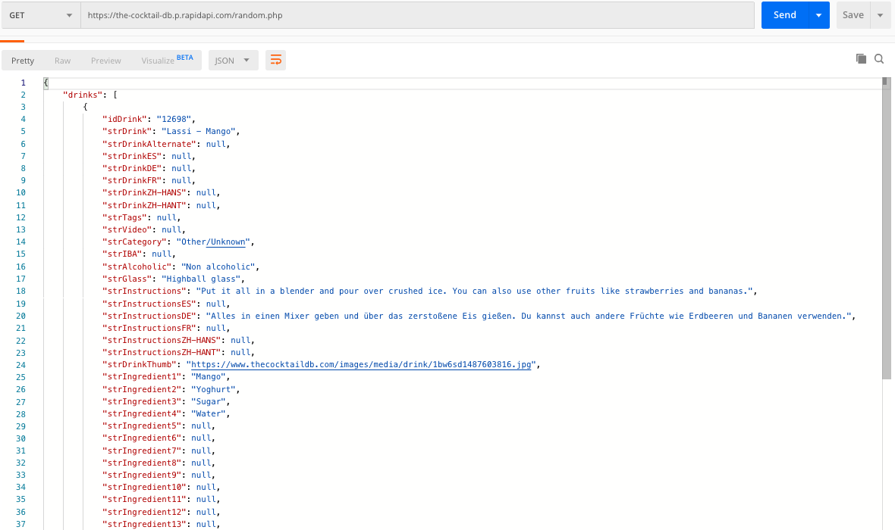
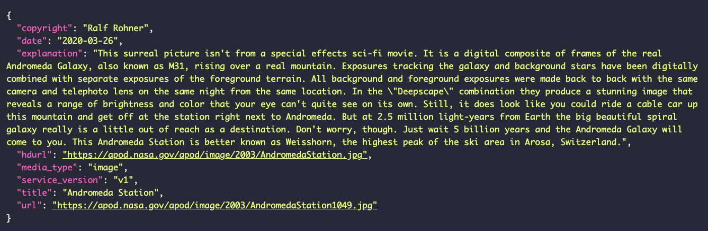
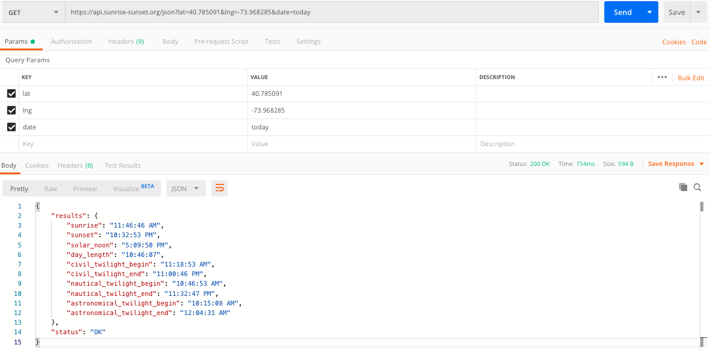
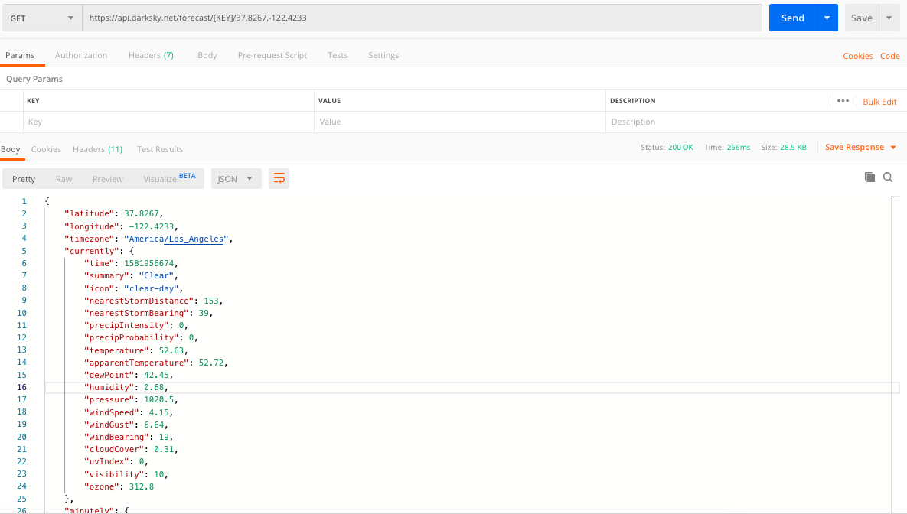

# Practicing Design Trends With React

## API's to Use

### Random Cocktail Generator
https://the-cocktail-db.p.rapidapi.com/random.php

### Nasa Picture of the Day [UPDATED]
https://api.nasa.gov/planetary/apod?api_key=DEMO_KEY

### Sunrise and Sunset
https://api.sunrise-sunset.org/json?lat=40.785091&lng=-73.968285&date=today

### Weather API
https://api.darksky.net/forecast/[KEY]/[LAT],[LON]

### Giphy API
api.giphy.com/v1/gifs/search

<!-- need to add sample -->

## Design Trends to Create
[Design Article #1](https://www-webdesignerdepot-com.cdn.ampproject.org/v/s/www.webdesignerdepot.com/2020/02/5-web-design-trends-for-2020-that-are-here-to-stay-with-us/amp/?usqp=mq331AQCKAE%3D&amp_js_v=0.1#referrer=https%3A%2F%2Fwww.google.com&amp_tf=From%20%251%24s&ampshare=https%3A%2F%2Fwww.webdesignerdepot.com%2F2020%2F02%2F5-web-design-trends-for-2020-that-are-here-to-stay-with-us%2F)

[Design Article #2](https://uxplanet.org/top-ui-ux-design-inspiration-85-a2decdf6be13)

[Design Article #3](https://tomkenny.design/articles/10-fantastic-and-creative-web-design-styles/)

## ToDo
3. Look up Bulma for transitions
5. Thinking about every button click changing the full design vs only cards as it is now. 
6. Create more components so the landing page doesnt get too cluttered. 
7. Implement Giphy with Weather API.
    - Weather API needs to be called server side. will try to make a Python Backend. 
8. Switch API calls to backend

## COMPLETED
1. Research how to send data through Link component.[COMPLETED]
    - Other option is to use hooks, research needed. 
    - Backup plan is context.
    - Reason for this is to limit api calls
    
2. Impliment context as theme changer for all types [COMPLETED]

4. Use Netlify to host enviroment variables [COMPLETED]

 
 
 

 
 
 

This project was bootstrapped with [Create React App](https://github.com/facebook/create-react-app).

## Available Scripts

In the project directory, you can run:

### `npm start`

Runs the app in the development mode. 
Open [http://localhost:3000](http://localhost:3000) to view it in the browser.

The page will reload if you make edits. 
You will also see any lint errors in the console.
